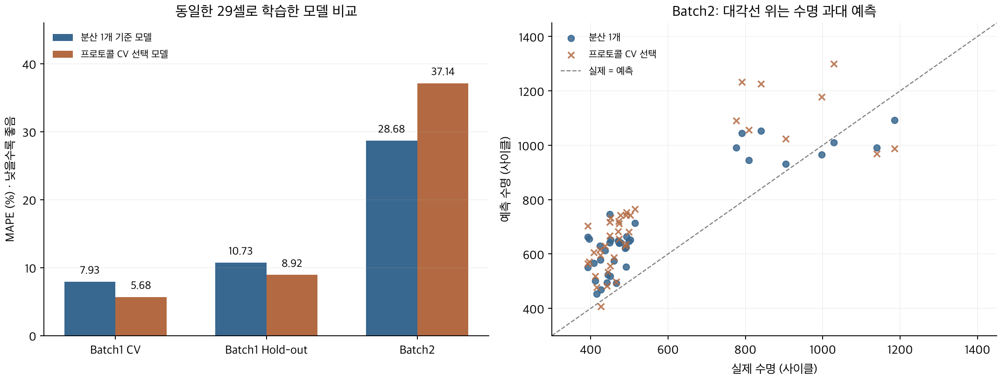

# ESS 배터리 수명 예측

**초기 100사이클의 측정값으로 배터리 셀의 총 수명을 예측**하고, 다른 실험 배치에서도 예측이 유지되는지 평가했다. ESS의 조기 품질 선별과 교체 계획에 활용할 수 있는 신호를 탐색하는 것이 목적이다.

[DAY1: EDA·모델 전략](outputs/final/DAY1_REPORT.md) · [DAY2: 개발·평가](outputs/day2/DAY2_REPORT.md) · [Batch3 추가 평가](outputs/day2/DAY2_BATCH3_TEST.md) · [실행 안내·과제 기준 점검](docs/PROJECT_GUIDE.md)

## 프로젝트 개요

- **데이터:** MIT–Stanford Battery Dataset 계열의 수업 제공 파일 (Severson et al., 2019).
- **학습:** Batch1 (2017-05-12). 원본 46셀 중 레이블 점검 후 36셀 사용.
- **평가:** Batch2 (2018-02-20) 39셀, 추가 Batch3 (2018-04-12) 44셀. 수명 결측 셀 제외.
- **태스크:** Regression. 정답은 제공된 총 수명 `cycle_life`; 주 지표는 MAPE(%), 보조 지표는 MAE·RMSE·R².
- **최종 검증 구조:** Batch1 개발 29셀에서 프로토콜 단위 5-fold CV → 별도 Hold-out 7셀 → 고정 모델로 Batch2·3 평가. 같은 C1·전환 SOC·C2 조합을 학습/검증 양쪽에 나누지 않았다.

## 파일 구조

```text
├── data/README.md                 # 원본 MAT 배치 안내
├── notebooks/
│   ├── 30-ESSHealth-DAY1-EDA.ipynb
│   ├── 40~44-*.ipynb             # 기준 모델·특징·규제·곡선 실험
│   ├── 45-*.ipynb                # 프로토콜 분리 최종 검증
│   ├── 46-*.ipynb                # Batch3 평가
│   └── 47-*.ipynb                # 비즈니스 부록: 저장 결과 분석
├── src/                          # 특징 추출·학습·평가·검산
├── outputs/
│   ├── final/                    # DAY1 보고서·그림
│   └── day2/                     # DAY2 보고서·실험별 모델·예측·성능표
├── docs/PROJECT_GUIDE.md          # 실행 순서·평가 기준 점검
├── requirements.txt
└── README.md
```

## 환경 설정

Python **3.11.15**, 라이브러리 버전은 `requirements.txt`에 고정했다. 아래는 macOS·Linux 기준이다.

```bash
git clone https://github.com/piw0814-create/data_project.git
cd data_project
python3.11 -m venv .venv
.venv/bin/python -m pip install -r requirements.txt
.venv/bin/python -m ipykernel install --user --name data-project --display-name "Python (data-project)"
.venv/bin/python -m jupyterlab
```

보고서·노트북에는 그래프와 실행 결과가 저장되어 있어 **열람에는 설치가 필요 없다.** 원본 EDA·특징 추출에는 [안내된 MAT 파일](data/README.md)이 필요하다. 저장 결과의 수치·분할·모델 무결성은 `.venv/bin/python -m src.verify_results`로 확인한다. 전체 실행 순서는 [실행 안내](docs/PROJECT_GUIDE.md)를 따른다.

## EDA: 발견과 모델링 시사점

| 질문 | 핵심 발견 | 모델 설계에 반영한 점 |
| --- | --- | --- |
| 수명 분포 | 500사이클 미만 비율: Batch1 0%, Batch2 71.79%, Batch3 0%. 1,000 초과 비율: 21.74%, 7.69%, 52.27% | 짧은 수명·긴 수명 구간의 오차를 따로 확인 |
| 열화 곡선·knee | 후기에 감소가 가속되는 셀이 많고, 급격한 감소 시작 시점은 셀마다 다름 | 초기 추세를 후보로 사용. 전체 수명을 본 뒤 알 수 있는 knee는 입력에서 제외 |
| ΔQ(V) | 대표 단수명 셀에서 100−10사이클 곡선 변화가 큼. 로그 분산과 수명의 상관은 배치별 −0.886, −0.902, −0.702 | 로그 ΔQ 분산 하나로 기준 모델 구성 |
| 충전 조건 | C1 단독으로 수명 순서를 설명하기 어려움. 전환 SOC·C2·실험 집단에 따라 차이가 남음 | 충전 조합을 후보 특징과 검증 그룹으로 고려 |
| 상관·데이터 품질 | ΔQ 평균·최솟값·분산의 정보 중복, 충전시간 극단값, IR=0 확인 | 대표 특징부터 시작해 추가·제거 비교. 시간은 중앙값, IR=0은 결측 처리 |

분포 통계는 DAY1의 수명값이 있는 셀 기준이다. DAY2에서는 Batch1의 후속 기록 연결 필요 5셀·실험 미완료 5셀을 추가 제외했다. 그래프와 해석은 [DAY1 보고서](outputs/final/DAY1_REPORT.md)에 함께 제시했다.

## Modeling

### 피처 엔지니어링 전략

공통 전압에서 `ΔQ(V) = Q100(V) − Q10(V)`를 계산했다. 로그 분산으로 시작해 최솟값, 초기 용량, 용량 변화율, 초기 감소 속도를 추가했다. **곡선의 변화와 초기 상태가 서로 보완적인 수명 정보를 줄 것**이라는 가설이었다. IR·온도·충전시간·C-rate도 추가 비교했으나 더 나은 최종 CV 후보를 만들지 못했다.

### 모델 선택 및 근거

- **후보:** 평균 예측·선형회귀를 기준으로, 작은 표본과 중복 특징을 고려한 Ridge·ElasticNet을 비교했다. 이후 특징 제거, 규제 강화, MAPE 가중 학습, IQR·PLS 표현을 비교했다.
- **최종 추천 모델:** 로그 ΔQ 분산 하나를 입력으로 총 수명을 직접 예측하는 **선형회귀** (`S0_linear`). 같은 29셀로 학습한 ElasticNet보다 Batch2·3 오차가 낮고 구조가 단순해 최종 추천으로 정했다.
- **이전 CV 선택 모델:** 로그 수명 ElasticNet. Batch1 CV에서는 가장 좋았지만 외부 배치에서는 분산 모델보다 오차가 컸다. 당시 선택 기록은 비교 근거로 유지한다.
- **입력·타깃:** `log10_delta_Q_var` 1개 → 원 단위 `cycle_life`. 초기 100사이클 이내 정보만 사용한다.
- **전처리:** CV 학습 폴드 안에서만 결측 대체·표준화를 학습했다. 개발 29셀로 이미 학습한 분산 모델을 그대로 사용하며 재학습하지 않았다.

## 성능 결과

### 같은 조건에서 모델을 비교한 결과

먼저 **동일한 Batch1 개발 29셀·Hold-out 7셀**로 비교했다. MAPE는 낮을수록 좋으며, CV는 개발 데이터를 5부분으로 나누어 번갈아 검증한 평균이다.

| 모델 | 입력 수 | Batch1 CV | Batch1 Hold-out | Batch2 | Batch3 |
| --- | ---: | ---: | ---: | ---: | ---: |
| 분산 1개 선형회귀 | 1 | 7.93% | 10.73% | **28.68%** | **12.09%** |
| 로그 ElasticNet | 5 | **5.68%** | **8.92%** | 37.14% | 15.10% |

- **내부 검증:** ElasticNet은 분산 모델보다 CV가 2.25%p, Hold-out이 1.80%p 낮았다. 초기 용량 등의 추가 정보가 Batch1 안에서는 도움이 된 것으로 보인다.
- **외부 평가:** ElasticNet은 오히려 Batch2에서 8.45%p, Batch3에서 3.01%p 높았다. Batch1에서 배운 추가 특징의 관계가 다른 배치에 그대로 적용되지는 않았다.
- **해석:** 특징을 늘려 내부 오차를 줄이는 것과 배치 간 예측을 개선하는 것은 달랐다. 이번 비교에서는 분산 하나의 단순한 관계가 외부 배치에서 더 잘 유지됐다.

### 최종 모델을 무엇으로 정했는가

**최종 추천은 단일 분산 선형회귀다.** Batch1 CV 최저 모델은 ElasticNet이었지만, 동일 학습 셀로 비교한 두 외부 배치에서는 분산 모델이 더 좋았다. 작은 데이터에서 특징을 늘리는 것보다 초기 곡선 변화의 핵심 신호 하나를 사용하는 편이 이번 비교에서 관측상 배치 간 예측에 유리했던 것으로 판단했다.

이 추천에는 **Batch2·3 결과가 반영됐다.** 따라서 아래 값은 최종 추천 모델의 기존 관측 성능이며, 추천 이후 독립적으로 확인한 테스트 성능은 아니다. 원래 CV 선택 기록을 바꾸거나 새로 학습하지 않았고, 다음 독립 배치에서 추가 확인할 모델로 정했다. 부록의 후속 손실 변경 실험은 배치와 검증 기준을 함께 만족하는 일관된 개선을 확립하지 못해 채택하지 않았다. 다만 분위수 0.5는 CV와 Batch2에서 더 좋아 유효한 대안이며, 현재 추천이 유일한 최적 모델이라는 뜻은 아니다.

최종 추천의 [모델 경로·선택 근거](outputs/day2/final_recommendation/recommendation.json)와 [성능표 CSV](outputs/day2/final_recommendation/performance_reporting.csv)를 별도로 보존했다.

### 교수님 지정 형식: 최종 추천 모델

분산 1개 선형회귀의 성능이다. Train은 학습 데이터 재예측 오차가 아니라 **CV 검증 평균**이다.

| 구분 | MAPE (%) | 비고 |
| --- | ---: | --- |
| Train (Batch 1 CV) | 7.93 | 개발 29셀, 프로토콜 단위 5-fold |
| Valid (Batch 1 Hold-out) | 10.73 | 별도 7셀 |
| Test (Batch 2) | 28.68 | 39셀; 최종 추천에 참고한 기존 평가 |
| Gap (Train-Valid) | +2.80 | Valid − CV; %p |
| Gap (Valid-Test) | +17.96 | Test − Valid; %p |
| Gap (Target-Test) | +19.58 | Test − 논문 참고값 9.1%; %p |
| Test (Batch 3) | 12.09 | 44셀; 최종 추천에 참고한 기존 평가 |
| Gap (Batch2-Batch3) | -16.60 | Batch3 − Batch2; %p |
| Gap (Target-Test, Batch3) | +2.99 | Batch3 − 과제 공통 참고값 9.1%; %p |

Gap (Train-Valid) **+2.80%p**보다 Valid → Batch2의 **+17.96%p**가 크다. 단순 모델에서도 배치 차이의 영향은 남았고, 논문 참고값 9.1% 대비 **+19.58%p**의 차이가 있었다. ElasticNet보다 외부 오차가 낮다는 이유로 추천했지만, 단수명 예측 문제를 해결한 모델은 아니다.

### 처음의 26.19% 모델과는 어떤 차이인가

초기 셀 분리에서 **28셀**로 학습한 분산 선형회귀는 Batch2 **26.19%**, Batch3 **11.94%**였다. 프로토콜을 분리한 현재 비교에서는 **29셀**로 학습해 **28.68% / 12.09%**가 나왔다. 둘 다 분산 하나를 사용하지만 학습 셀이 달라 별도 실험이며, 26.19%를 현재 프로토콜 검증 모델의 점수로 가져오지 않았다.



왼쪽은 내부 검증 개선이 Batch2 개선으로 이어지지 않은 결과다. 오른쪽에서 대각선 위 점은 실제보다 수명을 길게 예측한 셀이다.

학습 셀이 다른 점수 차이를 분리 방식만의 효과로 해석하지 않는다. Batch3는 수명이 길어 상대오차가 작아지는 영향도 있다. 최종 추천 모델의 MAE는 Batch2 **142.76**, Batch3 **150.22사이클**로 오히려 조금 커졌다.

9.1%는 논문 참고값이며, 사용 파일·학습/테스트 구성이 달라 동일 조건 재현은 아니다. 또한 개발 중 Hold-out·Batch2 결과를 반복 확인했으므로 완전히 독립적인 최종 테스트라는 조건은 충족하지 못했다. 후속 실험은 [비즈니스 부록](outputs/day2/DAY2_BUSINESS_APPENDIX.md)에 분리했다.

## 오류 분석

최종 추천 분산 모델의 Batch2 상대오차 상위 3셀은 **6·18·15번**이다. 실제 수명은 각각 **393·449·396**, 예측은 **662·746·656사이클**로 모두 단수명 과대예측이었다. Batch2 단수명 28셀의 MAPE는 **32.84%**였다. Batch3에서는 학습 최대 수명 1,054를 넘는 17셀 중 **16셀을 과소예측**했고, 이 구간의 MAPE는 **17.46%**였다.

**Batch1에 단수명 사례가 없고 수명 범위가 좁은 점은 성능 저하의 유력한 요인 중 하나다.** 다만 배치 간 초기 상태·충전 조건·특징–수명 관계 차이와 각각의 기여도를 분리하지 못했다. 단수명과 다양한 운영 조건의 사례를 보완하면 예측이 개선될 가능성이 있다는 가설이며, 별도 검증이 필요하다.

## ESS 도메인 해석

- **활용:** 초기 시험 결과로 정밀 검사가 필요한 셀을 선별하고, 교체·보증 계획을 위한 참고 수명을 제공할 수 있다.
- **오류 비용:** 단수명 과대예측은 교체 지연, 장수명 과소예측은 조기 폐기·활용 손실로 이어질 수 있다. 부록의 보수적 예측은 앞의 오류를 줄였지만 뒤의 오류를 키웠다.
- **실제 적용:** 실험실 셀 데이터를 사용했으므로 ESS의 온도·SOC 범위·부하 변화·달력 노화·팩 내 편차를 반영한 추가 검증이 필요하다. 운영에서는 배치별 입력 분포와 실제 오차를 추적하고, 새 조건의 데이터가 쌓이면 재학습하는 방향이 적절하다.

### 부록: 비즈니스 목적에 따라 예측을 바꾸면?

교체·보증 관리에서는 **실제보다 수명을 길게 예측하는 오류**가 더 큰 비용을 만들 수 있다고 가정했다. 이에 같은 Batch1 개발 29셀과 로그 ΔQ 분산 1개를 유지하고, 과대예측에 더 큰 벌점을 주는 **분위수 0.3 회귀**를 비교했다.

- **관측 결과:** 단수명 과대예측은 줄었고 Batch2 MAPE는 **28.68%→25.44%**로 개선됐다. 반면 장수명 과소예측이 커지면서 Batch3는 **12.09%→14.59%**로 악화됐다.
- **다른 대안:** 중앙값을 예측하는 분위수 0.5는 CV와 Batch2에서 개선됐지만 Hold-out·Batch3는 소폭 악화됐다. Batch2 오차를 더 중시한다면 고려할 만한 대안이다.

**전체 오차 최소화와 교체 지연 위험 감소는 같은 목표가 아닐 수 있다.** 배치와 검증 기준을 함께 만족하는 일관된 개선을 확립하지 못해 추가 모델은 채택하지 않았다. 실제 운영에서는 과대·과소예측의 비용을 정한 뒤 새 데이터에서 검증해야 한다. 이 비교는 외부 결과를 반복 확인한 후속 탐색이며, 자세한 결과는 [비즈니스 목적 부록](outputs/day2/DAY2_BUSINESS_APPENDIX.md)에 정리했다.

## 참고문헌

- [Severson et al. (2019)](https://www.nature.com/articles/s41560-019-0356-8). Data-driven prediction of battery cycle life before capacity degradation. *Nature Energy*, 4, 383–391.
- [원논문 공식 코드](https://github.com/rdbraatz/data-driven-prediction-of-battery-cycle-life-before-capacity-degradation): 데이터 처리·분할 비교.
- [Attia, Severson & Witmer (2021)](https://arxiv.org/abs/2101.01885): 초기 곡선 특징·모델 표현 참고.
